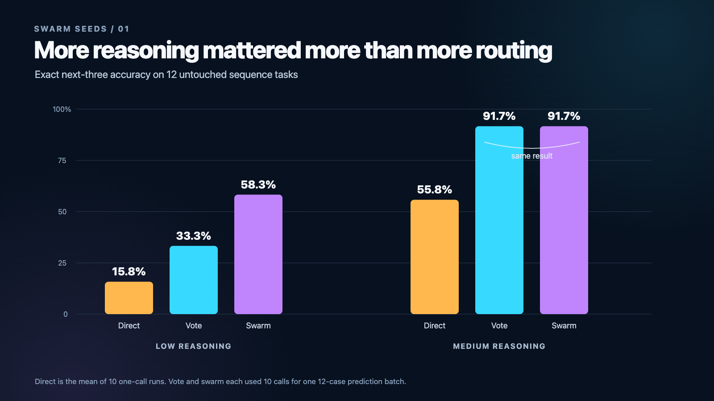

# 01: Reasoning vs Routing

This folder contains one reusable AI-agent orchestration seed and the complete experiment that produced it.

## The question

When an AI faces a difficult pattern problem, where should extra compute go?

- Give one agent more reasoning depth.
- Ask 10 independent agents and vote.
- Build a swarm that proposes, critiques, verifies, and judges.

## What we tested

GPT-5.6 Luna received the first 10 integers from each mathematical sequence and had to return the next 3 exactly.

The frozen benchmark contained 4 development cases and 12 untouched final cases. It included known combinatorial sequences, indexed recurrences, cumulative arithmetic patterns, and interleaved sequences.

For both low and medium reasoning, we measured:

- **Direct:** one deployed solver call, repeated 10 times to estimate expected one-call performance.
- **Vote:** the same 10 independent answers combined by a deterministic plurality rule.
- **Swarm:** exactly 10 calls arranged as 5 proposers, 2 critics, 2 verifiers, and 1 judge.

The vote and swarm therefore had the same call budget.

## Main result

| Reasoning | Direct | 10-agent vote | 5→2→2→1 swarm |
|---|---:|---:|---:|
| Low | 15.8% | 33.3% | 58.3% |
| Medium | 55.8% | 91.7% | 91.7% |

At medium reasoning, the vote and swarm had the same correct or wrong outcome on all 12 final cases. Both solved 11 of 12. The vote used about 3.3x less visible-token proxy and had about 2.4x lower latency.

At low reasoning, the swarm improved 25 percentage points over the vote. The 95% case-bootstrap interval was wide and crossed zero, so the result is promising rather than conclusive.

## Explore the actual run

A useful reading path:

1. [Read the reusable skill](SKILL.md).
2. [Read the frozen protocol](experiment/PROTOCOL.md).
3. [Inspect the exact 16 mathematical sequences](experiment/benchmark/manifest.json).
4. [Read the technical report](experiment/REPORT.md).
5. [Inspect every raw output](experiment/raw/), including malformed and stalled attempts.
6. [Review the scored results](experiment/results/) and [final audit](experiment/final_audit.json).
7. [View the result images](images/).



## What is preserved

```text
SKILL.md
experiment/
  README.md
  REPORT.md
  PROTOCOL.md
  benchmark/
  prompts/
  raw/
  packets/
  results/
  scripts/
  plots/
  development_audit.json
  final_audit.json
  freeze_manifest.json
images/
  five result charts
```

This is not a cleaned-up reconstruction. It is the original frozen run, including failures, scoring penalties, uncertainty, and reproducibility records.

## Scope

The result applies to this model, benchmark, prompt design, and run. Mathematical sequence continuation is underdetermined, the final sample is small, and named sequences may overlap model training data. The seed is a method to test, not a universal claim about every AI task.
