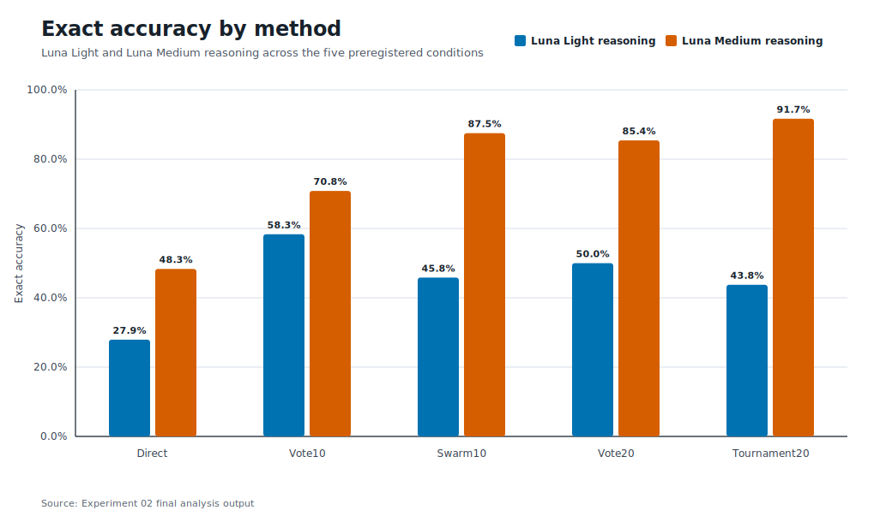
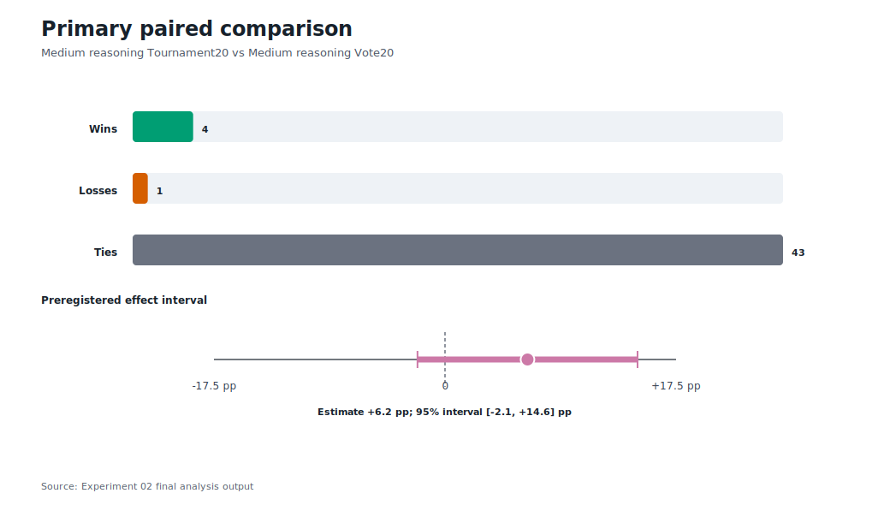
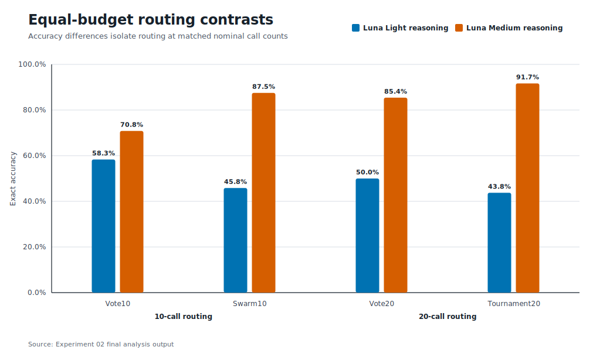
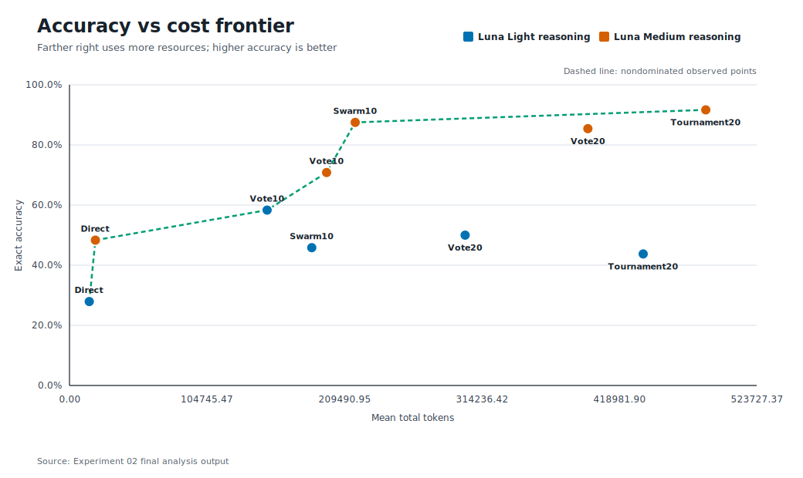
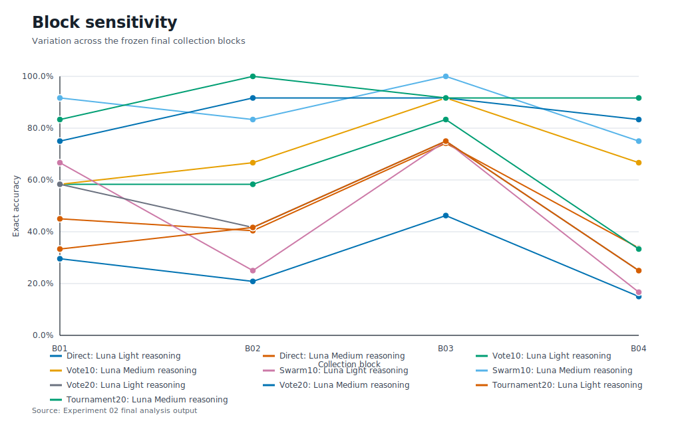

# Hard Sequence Scaling: Final Report

## Result in one sentence

On 48 hidden RuleWeave-5 cases, moving GPT-5.6 Luna from Light to Medium reasoning helped far more than changing the agent routing, while the 20-call Medium tournament reached the highest point estimate at 91.67% exact accuracy.



## Final results

Every case required five exact future integers. One wrong integer made the full answer incorrect.

| Reasoning | Direct expected | Vote10 | Swarm10 | Vote20 | Tournament20 |
|---|---:|---:|---:|---:|---:|
| Light | 27.92% | 58.33% | 45.83% | 50.00% | 43.75% |
| Medium | 48.33% | 70.83% | 87.50% | 85.42% | **91.67%** |

`Direct expected` is the mean exact accuracy across 20 independent one-call slots. The other values are the exact final answers deployed by each aggregate method.

The preregistered primary comparison was Medium Vote20 against Medium Tournament20:

- Tournament20: 44 of 48 correct, or 91.67%
- Vote20: 41 of 48 correct, or 85.42%
- observed difference: +6.25 percentage points for Tournament20
- Tournament20-only wins: 4
- Vote20-only wins: 1
- both correct: 40
- both wrong: 3
- exact two-sided McNemar p-value: 0.375
- stratified bootstrap 95% interval: -2.08 to +14.58 percentage points

The point estimate favored the tournament, but the primary result is **inconclusive**. The experiment does not establish that the 20-call tournament is better than a 20-call vote.



## The clearest finding

The preregistered average reasoning lift was +34.38 percentage points. The average structured-routing lift at equal 10-call and 20-call budgets was only +1.04 points.

The difference between those lifts was +33.33 points. Its Holm-adjusted p-value was about 0.00009. On this benchmark, stronger reasoning mattered much more than whether the calls were arranged as a vote or a role-based team.



Routing still interacted with reasoning:

- At Light reasoning, Swarm10 trailed Vote10 by 12.50 points and Tournament20 trailed Vote20 by 6.25 points.
- At Medium reasoning, Swarm10 led Vote10 by 16.67 points and Tournament20 led Vote20 by 6.25 points.
- None of those individual routing contrasts remained significant after the frozen Holm correction.

This suggests that a structured team can help when its agents reason well enough to use the transferred evidence. It does not show that more orchestration is automatically better.

## What was tested

One GPT-5.6 Luna model was used in two isolated conditions:

- Light reasoning, implemented with the model's low reasoning setting
- Medium reasoning, implemented with the model's medium reasoning setting

Five deployment methods were compared:

| Method | Calls | Construction |
|---|---:|---|
| Direct expected | 1 | Expected one-call accuracy estimated from 20 independent slots |
| Vote10 | 10 | Exact deterministic vote over slots S01 to S10 |
| Swarm10 | 10 | 5 proposers, 2 critics, 2 verifiers, 1 judge |
| Vote20 | 20 | Exact deterministic vote over all 20 independent slots |
| Tournament20 | 20 | 8 explorers, 4 breakers, 4 verifiers, 2 synthesizers, 1 red team, 1 judge |

The independent pool was reused only to derive Direct, Vote10, and Vote20. Structured methods used fresh calls. Light and Medium outputs never crossed arms. Experimental subjects had no tools, code execution, calculators, web access, files, or communication outside the frozen packets.

The final collection used 400 model calls and produced 4,800 case responses. Calls ran at a maximum concurrency of 20.

## The exact sequence mathematics

RuleWeave-5 is procedural rather than a list of familiar puzzle sequences. It shows 12 terms for `hard`, 13 for `very-hard`, or 14 for `stress`, then asks for the next 5.

Many families use a polynomial in the binomial basis:

\[
B_c(x)=\sum_{j=0}^{d} c_j {x \choose j}
\]

The eight registered families are:

1. **POLY:** \(a_n=B_c(n-1)\).
2. **PDELTA:** start with \(a_1=s\). For \(n\ge2\), let \(t=n-2\), \(r=t\bmod p\), and \(q=\lfloor t/p\rfloor\). Then \(a_n=a_{n-1}+B_{c_r}(q)\).
3. **AFFINE:** \(a_1=s\), then \(a_n=m_r a_{n-1}+b_r\), where \(r=(n-2)\bmod p\).
4. **LIN2:** after seeds \(a_1,a_2\), use \(a_n=u a_{n-1}+v a_{n-2}+b_r\), where \(r=(n-3)\bmod p\).
5. **LAGPOLY:** after \(L\) seeds, let \(r=(n-1)\bmod L\) and \(q=\lfloor(n-1)/L\rfloor-1\). Then \(a_n=a_{n-L}+B_{c_r}(q)\).
6. **INTERLEAVE:** weave two or three independent subsequences. Each strand is either a binomial-basis polynomial or an affine recurrence.
7. **GROWBLOCK:** block \(j\) has length \(l_0+j\). Its term at offset \(t\) is \(V(j)+tD(j)\), where \(V\) and \(D\) are binomial-basis polynomials.
8. **MODAFFINE:** \(a_n=(m_r a_{n-1}+b_r)\bmod M\).

The hidden recognizer enumerated registered explanations for every visible prefix. A case was accepted only when all matching registered programs predicted the same next five values. The final set contains 48 cases, with 2 cases in every family and difficulty cell. Each family appears 6 times and each tier appears 16 times.

## Cost

Mean measured total tokens per 12-case block were:

| Reasoning | Direct expected | Vote10 | Swarm10 | Vote20 | Tournament20 |
|---|---:|---:|---:|---:|---:|
| Light | 15,076 | 150,616 | 184,655 | 301,530 | 437,237 |
| Medium | 19,754 | 195,949 | 217,757 | 395,083 | 484,933 |

The structured methods cost more tokens than equal-call voting because later agents receive earlier outputs. Tournament20 used about 23% more tokens than Vote20 at Medium reasoning for a 6.25-point higher, but statistically inconclusive, exact-accuracy estimate.



## Stability and uncertainty

The primary difference remained positive in every leave-one-block-out calculation, ranging from +5.56 to +8.33 points. A whole-block bootstrap produced a positive interval, but it changed the formal classification. The report therefore follows the preregistered stratified case bootstrap and marks the primary result inconclusive and block-sensitive.



The 48 cases are larger than Experiment 01, but still small for distinguishing two methods near 90% accuracy. The cases also come from one synthetic grammar. Results may not transfer to research, coding, markets, or open-ended planning.

## Reliability and deviations

All 400 planned calls closed. There were no timeouts, infrastructure failures, model-setting drifts, prompt-identity drifts, or retries in the authoritative final log.

Four Light Tournament20 verifier calls returned schema-invalid rankings with duplicate candidate IDs. They were completed model responses, so the frozen rule preserved them and did not rerun them. All four downstream final judges returned valid case answers. This is why final-method format compliance is 100% even though call-level structured validity was 396 of 400.

For future runs, the reusable skill recommends freezing one automatic retry for a schema-invalid response before collection begins. That policy was not applied retroactively here.

### Packet-limit amendment

The frozen runner accepted packets up to 60,000 characters. At 395 of 400 calls, two unopened final-judge packets were 61,255 and 62,622 characters. Correctness had not been opened. A documented operational amendment raised the acceptance ceiling uniformly to 65,000 for all five unopened judges. Their packet contents, prompts, identities, routing, and scores did not change. Each judge ran once in a fresh session.

This preserved nearly complete blinded evidence, but it is a protocol deviation. The details and hashes are in [`PROTOCOL_AMENDMENT_01.md`](PROTOCOL_AMENDMENT_01.md).

### Post-collection scorer correction

The frozen scorer dropped role provenance while reading the append-only attempt log. That made valid structured rows appear to have no role. The frozen scorer remained unchanged. A small post-collection overlay preserved the existing role, call, batch, and reasoning fields before using the frozen scoring logic. It did not change answers or scoring rules, and its own hash plus the frozen scorer hash are recorded in the result provenance.

## Practical lessons

1. Increase reasoning quality before adding elaborate routing.
2. Independent voting is a strong, simple baseline and should always be included.
3. Structured routing may become useful only when the underlying agents can evaluate transferred evidence reliably.
4. Preflight the largest downstream packet, not only the first-stage prompts.
5. Decide malformed-output retries before collection.
6. Keep the harness small. One standard-library Python runner and append-only logs were enough for the final run.

## Reproduce the checks

From `02-hard-sequence-scaling/`:

```bash
python3 -B experiment/scripts/verify_benchmark.py
python3 -B experiment/scripts/score_results_postcollection.py --results experiment/raw/final/attempts.jsonl --answers experiment/benchmark/hidden/final_answers.jsonl --manifest experiment/run_manifest.json --case-manifest experiment/benchmark/public/final_blocks.json --collection-closed experiment/raw/final/collection_closed.json --output experiment/results/scored_results.json
python3 -B experiment/scripts/analyze_results.py --scored experiment/results/scored_results.json --output experiment/results/analysis.json --replicates 50000 --seed 20260713
python3 -B experiment/scripts/render_charts.py --input experiment/results/analysis.json --output-dir plots
python3 -B experiment/scripts/audit_release_postcollection.py --experiment-dir experiment --manifest experiment/run_manifest.json --attempts experiment/raw/final/attempts.jsonl --answers experiment/benchmark/hidden/final_answers.jsonl --freeze-manifest experiment/freeze_manifest.json --scored experiment/results/scored_results.json --analysis experiment/results/analysis.json --collection-closed experiment/raw/final/collection_closed.json --case-manifest experiment/benchmark/public/final_blocks.json --release-dir . --output /tmp/swarm-seeds-02-release-audit.json
```

All experiment scripts use the Python standard library. No external package is required for generation, scoring, analysis, chart rendering, or audit.

## Evidence map

- [`PROTOCOL.md`](PROTOCOL.md): frozen design and execution rules
- [`ANALYSIS_PLAN.md`](ANALYSIS_PLAN.md): preregistered comparisons and statistics
- [`benchmark/`](benchmark/): public cases, hidden programs, answers, and recognizer audit
- [`prompts/`](prompts/): every frozen role prompt and schema
- [`raw/final/attempts.jsonl`](raw/final/attempts.jsonl): authoritative append-only final call log
- [`results/scored_results.json`](results/scored_results.json): case-level deterministic scoring
- [`results/analysis.json`](results/analysis.json): uncertainty, paired tests, costs, and reliability
- [`results/release_audit.json`](results/release_audit.json): 3,103 passing public-release checks
- [`../plots/`](../plots/): standard-library SVG charts
- [`../SKILL.md`](../SKILL.md): reusable orchestration seed
