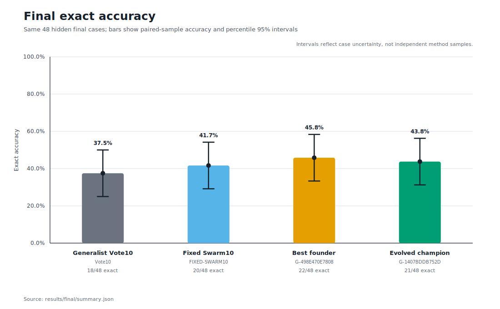

# 03: Evolving Light Swarms

Can a small evolutionary search discover a better way to organize ten GPT-5.6 Luna Light calls?

This seed preserves the complete experiment that tested that question. The optimizer changed only the orchestration policy. The model, Light reasoning setting, task, prompts, schemas, call budget, and retry rules stayed fixed.

## What evolved

Each policy was a symbolic genome with three parts:

- one 10-call topology;
- nine frozen worker-lens identifiers;
- one final decision policy.

The search began with six policies across four structures:

- 9 proposers and 1 judge;
- 7 proposers, 2 critics, and 1 judge;
- 7 specialized proposers, 2 verifiers, and 1 judge;
- 5 proposers, 2 revisers, 2 verifiers, and 1 judge.

A deterministic Python program selected parents, made one-gene mutations, and crossed policies. The language model never wrote or edited its own genome.

## The evaluation

The experiment used fresh RuleWeave-5 mathematical sequences with no sequence or generator-program overlap with Experiment 02.

| Stage | Cases | Purpose | Calls |
|---|---:|---|---:|
| Training | 12 | Evaluate 6 genomes across 3 generations | 180 |
| Validation | 24 | Select one champion from the top 3 | 60 |
| Hidden final | 48 | Registered comparison of 4 methods | 160 |
| **Registered total** | | | **400** |
| Amendment 01 | Same 48 | Restore the registered generalist Vote10 baseline | 40 |
| **Recorded total** | | | **440** |

Every model call received a complete 12-case block and predicted the next five terms for every sequence. All methods in the hidden comparison used exactly ten calls per block.

The final methods were:

- the evolved validation champion;
- the best original founder;
- ten independent generalist solvers combined by deterministic vote;
- a fixed hand-designed 10-call swarm.

The original 400-call implementation accidentally gave the independent solvers a mixture of specialized lenses. A release audit found the mismatch after final answers were opened. [Amendment 01](experiment/AMENDMENT-01.md) added the one missing 40-call generalist baseline without changing any prompt component or scorer. Its runner used a disclosed 600-second ceiling instead of the registered 300-second ceiling; all calls finished within 82.308 seconds, so none depended on the difference. The original diversified pool remains available as a separately labeled sensitivity result.

## Result

| Method | Exact cases | Exact accuracy | Correct terms | Reported tokens |
|---|---:|---:|---:|---:|
| Best founder | **22/48** | **45.83%** | **126/240** | 616,165 |
| Evolved champion | 21/48 | 43.75% | 123/240 | 644,209 |
| Corrected generalist Vote10 | 18/48 | 37.50% | 116/240 | **593,809** |
| Fixed Swarm10 | 20/48 | 41.67% | 117/240 | 657,656 |

The evolved champion finished three cases ahead of the corrected generalist Vote10. Their paired difference was +6.25 percentage points, with a 95% bootstrap interval from -4.17 to +16.67 points and exact McNemar p = 0.453. The interval includes zero, so superiority was not established.

The original diversified independent pool scored 21/48 and tied the champion, but it answers a different architecture question and is not the registered Vote10 baseline. The best founder finished one case ahead of the champion. None of the paired comparisons supported superiority. The evolutionary search raised the best observed training score from 8/12 to 9/12 and found a clear validation winner at 13/24, but the hidden evidence remains too uncertain to claim a generalizable evolutionary gain.

## What we learned

Evolution successfully searched the orchestration space and produced a promising point estimate against ten generalists, but this small run did not establish a better final system.

The useful result is about selection noise. Reusing 12 training cases across 18 genomes made it easy to find policies that looked better on training. A 24-case validation gate reduced that risk but did not remove it. On the 48 untouched final cases, the selected champion's lead over ten generalists remained uncertain, it tied the diversified pool, and it trailed its own founder by one case.

The champion's judge changed ten proposer pluralities. Three changes helped, three hurt, and four were neutral. More elaborate judgment did not create a net exact gain. The diversified independent pool's tie with the champion also suggests that varied solving perspectives can matter without a multi-stage judge.

For the next run, the optimizer should receive a broader training signal, such as multiple independently generated training blocks or resampled fitness across several seeds. Evolution should earn complexity only after beating Vote10 repeatedly on fresh blocks.

## Open the evidence

- [Reusable skill seed](SKILL.md)
- [Technical report](experiment/REPORT.md)
- [Frozen protocol](experiment/PROTOCOL.md)
- [Post-unblinding baseline correction](experiment/AMENDMENT-01.md)
- [Benchmark and exact sequence definitions](experiment/benchmark/README.md)
- [Experiment 02 overlap audit](experiment/benchmark/overlap_with_experiment_02.json)
- [Symbolic genomes and lineage](experiment/genomes/README.md)
- [Exact prompts](experiment/prompts/)
- [Run records and raw last messages](experiment/runs/)
- [Final scoring](experiment/results/final/summary.json)
- [Diversified-pool sensitivity scoring](experiment/results/final-diversified-vote/summary.json)
- [Independent analysis](experiment/results/analysis.md)
- [Release audit](experiment/results/release-audit.json)
- [Deterministic chart generator](experiment/scripts/render_charts.py)

All 400 registered calls and all 40 Amendment 01 correction calls completed with valid output on their first attempt. No correctness-based reruns occurred. The largest observed concurrent wave contained 50 processes.

## Continue with Echohive

This experiment is fully open here. Readers who want to follow the broader work can visit [Echohive](https://www.echohive.ai/), use [Get Amplified](https://www.echohive.ai/get-amplified) as a practical field guide to models, agents, and harnesses, or join the [1000x Lab](https://www.echohive.ai/1000x-lab) where current research and working methods are explored live on Sundays.
