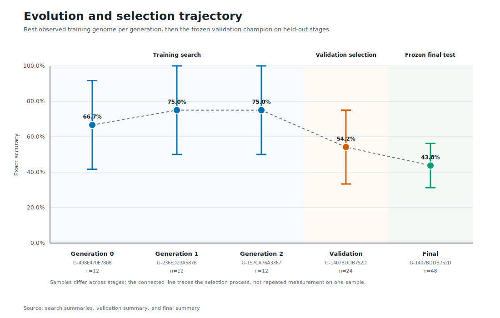
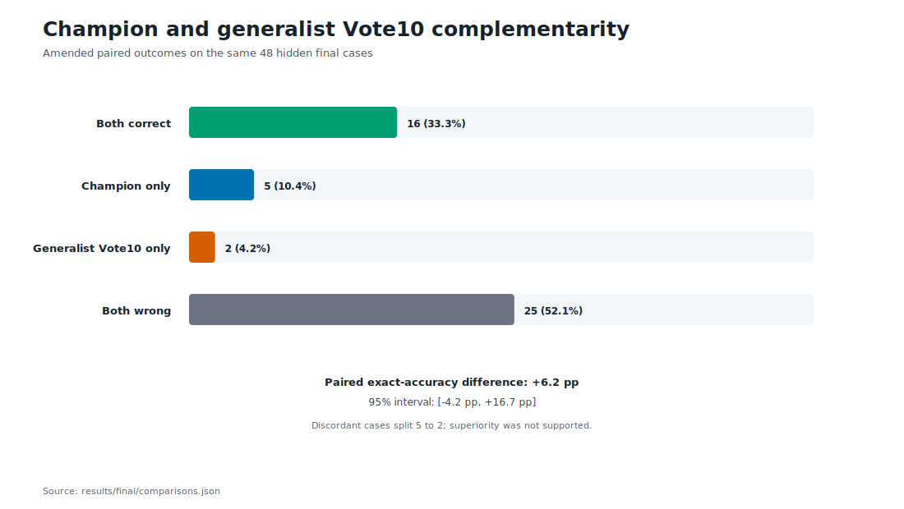

# Experiment 03: Evolving Light Swarms

## Result in one sentence

A deterministic three-generation search improved the best training score from 8 of 12 to 9 of 12 exact cases. On 48 untouched final cases, the validation-selected genome scored 21/48 and the corrected ten-generalist Vote10 scored 18/48. The +6.25 percentage-point estimate favored the champion, but its paired 95% interval of -4.17 to +16.67 points included zero. The best unevolved founder scored 22/48.

This is an inconclusive result for the registered hypothesis. The run does not establish that symbolic evolution improved this Light-reasoning orchestration system. The baseline correction was collected after final unblinding, so its chronology and the original diversified-pool result remain explicit throughout this report.

## Question

Can a small evolutionary search discover a better way to organize ten GPT-5.6 Luna calls without making any individual call stronger?

Every experimental subject used the same requested model, `gpt-5.6-luna`, with provider reasoning effort `low`, reported publicly as **Light reasoning**. Each method received ten planned calls per 12-case block. The evolving system could change only three symbolic gene classes:

- a frozen ten-call topology;
- one frozen role-lens identifier for each of nine worker slots;
- one frozen final judge policy.

Evolution could not rewrite prompt prose, increase reasoning effort, add calls, use tools, inspect hidden answers, or ask another model to design mutations. The complete registered design is in [`PROTOCOL.md`](PROTOCOL.md), and the pre-run hashes and budgets are in [`freeze_manifest.json`](freeze_manifest.json).

## Fresh RuleWeave-5 benchmark

RuleWeave-5 was generated specifically for this experiment. Each case shows 12 to 14 integer terms and requires the next five terms as exact canonical decimal strings. One wrong term makes the case incorrect. Per-term accuracy is secondary.

The generator uses the binomial polynomial basis

\[
B_c(x)=\sum_{j=0}^{d} c_j {x \choose j}
\]

inside eight registered mechanism families:

1. **POLY:** \(a_n=B_c(n-1)\).
2. **PDELTA:** periodic polynomial increments are added to the previous term.
3. **AFFINE:** \(a_n=m_r a_{n-1}+b_r\), with periodic phase \(r\).
4. **LIN2:** \(a_n=u a_{n-1}+v a_{n-2}+b_r\), again with periodic bias.
5. **LAGPOLY:** each lagged subsequence advances by its own polynomial increment.
6. **INTERLEAVE:** two or three polynomial or affine streams are woven together.
7. **GROWBLOCK:** block lengths grow while polynomial functions control each block's level and slope.
8. **MODAFFINE:** \(a_n=(m_r a_{n-1}+b_r)\bmod M\).

Cases were divided into `hard`, `very-hard`, and `stress` tiers. The benchmark contains:

- 12 training cases used throughout evolution;
- 24 fresh validation cases, one for every family and tier cell;
- 48 untouched final cases, two for every family and tier cell.

A hidden recognizer rejected ambiguous prefixes unless every registered full-prefix explanation produced the same next five terms. The benchmark manifest records the split design, generation seed hash, arithmetic bounds, ambiguity policy, and SHA-256 checksum of every public and hidden file. A separate exact audit found zero overlap with Experiment 02 across visible prefixes, hidden generator programs, and next-five targets. See [`benchmark/README.md`](benchmark/README.md), [`benchmark/manifest.json`](benchmark/manifest.json), [`benchmark/overlap_with_experiment_02.json`](benchmark/overlap_with_experiment_02.json), and [`benchmark/hidden/recognizer_audit.json`](benchmark/hidden/recognizer_audit.json).

## Symbolic search

The initial population contained six distinct genomes across four topology species:

| Topology | Ten-call structure |
|---|---|
| Consensus | 9 proposers, 1 judge |
| Falsification | 7 proposers, 2 critics, 1 judge |
| Specialization | 7 proposers, 2 verifiers, 1 judge |
| Paired revision | 5 proposers, 2 revisers, 2 verifiers, 1 judge |

Generation 0 used two consensus founders, two falsification founders, one specialization founder, and one paired-revision founder. The exact symbolic catalog is [`genomes/GENOME_CATALOG.json`](genomes/GENOME_CATALOG.json), while the immutable lens and judge prose is in [`prompts/LENSES.json`](prompts/LENSES.json).

The search used a fixed PRNG seed and stopped after three generations regardless of the score. After each scored generation, the controller selected the best two genomes seen so far and generated:

- four deterministic one-gene mutations;
- two deterministic crossovers;
- no duplicate genome previously seen in the run.

Fitness was lexicographic: more exact cases, fewer harmful overrides of a correct proposer plurality, more correct terms, more format-valid cases, then the canonical genome hash. The standard-library controller, including artifact hashes and reconstructible lineage, is [`scripts/evolve.py`](scripts/evolve.py).

## Frozen budget and hidden-answer discipline

The registered budget was fixed before collection:

| Phase | Calculation | Planned calls |
|---|---:|---:|
| Evolution | 6 genomes x 3 generations x 10 calls | 180 |
| Validation | 3 finalists x 2 blocks x 10 calls | 60 |
| Final | 4 methods x 4 blocks x 10 calls | 160 |
| **Registered total** | | **400** |

Training scores alone produced the three validation finalists. All 24-case validation predictions were collected before the hidden validation answers were used to freeze one champion. The final population then bound together that champion, the best Generation 0 founder, and the fixed Swarm10 baseline before any final scoring. The original independent pool was run separately at the same per-block call budget.

During the final release review, after hidden final answers had been opened and scored, an audit found that the original independent-pool implementation gave its ten isolated solvers a fixed mixture of role lenses. The protocol had specified ten **generalist** solvers. The pool therefore satisfied independence and call equality but did not implement the named Vote10 baseline.

[`AMENDMENT-01.md`](AMENDMENT-01.md) records the correction. Forty fresh isolated generalist calls were run, ten per final block, using the frozen model request, common prefix, generalist lens, schema, restrictions, retry rules, and deterministic scorer. No hidden answer or prior output entered those prompts. The registered execution remains 400 calls; the correction brings total recorded experimental execution to 440. Because the correction occurred post-unblinding, it restores the protocol-determined baseline without erasing the chronology. The correction runner used a 600-second ceiling instead of the registered 300-second ceiling. No correction call timed out and the longest took 82.308 seconds, so no output depended on the longer ceiling. The original diversified pool remains a superseded exploratory sensitivity arm.

The artifact chain makes these decisions inspectable:

- [`genomes/validation-selection.json`](genomes/validation-selection.json) contains all 18 training-scored genomes and the deterministic top three.
- [`genomes/champion-freeze.json`](genomes/champion-freeze.json) records the validation ranking and frozen champion.
- [`genomes/final-population.json`](genomes/final-population.json) is bound to the champion-freeze hash.
- [`results/search/`](results/search/) contains generation-level training scores.
- [`results/validation/summary.json`](results/validation/summary.json) is bound to the frozen validation-answer hash.
- [`results/final/summary.json`](results/final/summary.json) is bound to the frozen final-answer hash.
- [`results/final-diversified-vote/summary.json`](results/final-diversified-vote/summary.json) preserves the original diversified-pool sensitivity score.

The immutable pre-run manifest still verifies against the frozen protocol, benchmark, prompts, schemas, scripts, founders, and hidden answers. This protects the train, validation, and final split definitions from post-result editing. It does not independently attest provider-side model identity; the runner records the requested model and effort, but its response ledger has no separate provider-reported model field.

## Search lifecycle

The six founders produced a best Generation 0 score of 8 of 12. Generation 1 found two genomes at 9 of 12. Generation 2 produced another 9-of-12 genome, but it had one harmful override and therefore ranked behind both Generation 1 leaders.

| Stage | Best new genome | Exact cases | Harmful overrides | Correct terms | Outcome |
|---|---|---:|---:|---:|---|
| Generation 0 | `G-498E470E7808` | 8/12 | 0 | 44/60 | Best founder by tie-break |
| Generation 1 | `G-236ED23A587B` | 9/12 | 0 | 48/60 | Training rank 1 |
| Generation 1 | `G-1407BDDB752D` | 9/12 | 0 | 45/60 | Training rank 2 |
| Generation 2 | `G-157CA76A3367` | 9/12 | 1 | 46/60 | Training rank 3 |

The full generation artifacts are [`genomes/generation-00.json`](genomes/generation-00.json), [`genomes/generation-01.json`](genomes/generation-01.json), and [`genomes/generation-02.json`](genomes/generation-02.json). Their score summaries are under [`results/search/`](results/search/).

The validation set reordered the three training finalists:

| Validation rank | Genome | Training | Validation | Validation terms | Harmful overrides |
|---:|---|---:|---:|---:|---:|
| 1 | `G-1407BDDB752D` | 9/12 | 13/24 | 77/120 | 1 |
| 2 | `G-157CA76A3367` | 9/12 | 9/24 | 63/120 | 1 |
| 3 | `G-236ED23A587B` | 9/12 | 9/24 | 57/120 | 3 |

The frozen champion, `G-1407BDDB752D`, was a Generation 1 crossover. It combined a falsification topology with an evidence-weighted judge and lens genes descended from the two best founders. Its complete parent and source-slot map is preserved in [`genomes/champion-freeze.json`](genomes/champion-freeze.json).

## Untouched final results

All four amended primary methods used 40 planned calls over four blocks and produced 48 format-valid final cases.

| Method | Construction | Exact cases | Exact accuracy | Correct terms | Term accuracy | Harmful overrides | Calls |
|---|---|---:|---:|---:|---:|---:|---:|
| Evolved champion `G-1407BDDB752D` | 7 proposers, 2 critics, 1 judge | 21/48 | 43.75% | 123/240 | 51.25% | 3 | 40 |
| Corrected generalist Vote10 | 10 independent generalist proposals, deterministic plurality | 18/48 | 37.50% | 116/240 | 48.33% | 0 | 40 |
| Best founder `G-498E470E7808` | 9 proposers, 1 judge | **22/48** | **45.83%** | **126/240** | **52.50%** | 4 | 40 |
| Fixed Swarm10 | 5 proposers, 2 critics, 2 verifiers, 1 judge | 20/48 | 41.67% | 117/240 | 48.75% | 2 | 40 |

The final summary and all case-level outcomes are in [`results/final/summary.json`](results/final/summary.json) and [`results/final/case_matrix.csv`](results/final/case_matrix.csv).

The original diversified independent pool scored 21/48 exactly and 124/240 terms. It tied the champion, with five unique wins on each side and a paired 95% interval from -12.5 to +12.5 points. This sensitivity result is preserved in [`results/final-diversified-vote/`](results/final-diversified-vote/) but is not the protocol-registered Vote10 baseline.

## Paired comparisons

The analysis used 50,000 paired case-bootstrap replicates stratified by frozen 12-case block, plus an exact two-sided McNemar test.

| Comparison | Difference | 95% interval | Champion-only vs comparison-only wins | McNemar p |
|---|---:|---:|---:|---:|
| Champion minus corrected generalist Vote10 | +6.25 pp | -4.17 to +16.67 pp | 5 vs 2 | 0.453 |
| Champion minus best founder | -2.08 pp | -12.50 to +8.33 pp | 3 vs 4 | 1.000 |
| Champion minus fixed Swarm10 | +2.08 pp | -8.33 to +12.50 pp | 4 vs 3 | 1.000 |

For the amended primary comparison, champion versus corrected generalist Vote10, 16 cases were correct for both methods and 25 were wrong for both. The champion won five discordant cases and Vote10 won two. The point estimate favored the champion, but the interval included zero and no comparison supported superiority. Full paired results are in [`results/final/comparisons.json`](results/final/comparisons.json).

## Selection overfitting

The held-out stages exposed a winner's-curse pattern.

The search evaluated 18 genomes against the same 12 training cases. The observed best score rose from 8/12 among founders to 9/12 among descendants, but a one-case increase on such a small reused set can arise from model variance or selection over noise. Validation reduced this risk, yet it selected the largest of only three noisy 24-case estimates. The winning validation estimate was 13/24, or 54.17%, while the same frozen genome reached 21/48, or 43.75%, on final.

The best founder then finished one final case ahead of the champion. That difference is far too uncertain to establish that evolution made the system worse. It does show that the training and validation advantages did not survive the untouched comparison.

This is best described as **selection overfitting consistent with a winner's curse**, not as proven causal overfitting. The experiment used proper held-out data, so the failure to generalize became visible instead of being reported as an evolutionary gain.

## Reliability

The inconclusive result was not caused by stalled or malformed experimental calls. All 400 registered calls and all 40 Amendment 01 correction calls returned valid output, with one attempt per planned call, zero failed jobs, zero open jobs, and zero malformed scored calls.

| Run | Valid jobs |
|---|---:|
| Search Generation 0 | 60/60 |
| Search Generation 1 | 60/60 |
| Search Generation 2 | 60/60 |
| Validation | 60/60 |
| Final structured methods | 120/120 |
| Original diversified independent pool | 40/40 |
| **Registered total** | **400/400** |
| Amendment 01 generalist Vote10 correction | 40/40 |
| **Total recorded execution** | **440/440** |

A clean deterministic replay regenerated Generation 1, Generation 2, the validation selection, and the champion freeze byte-for-byte from the frozen controller and stored score summaries. Independent rescoring likewise reproduced every primary and diversified-sensitivity CSV and JSON byte-for-byte.

Request-identity hashes include the execution timeout. They verify 300 seconds for every registered call and 600 seconds for every Amendment 01 correction call. The correction's maximum observed duration was 82.308 seconds and no call timed out. The longer ceiling did not affect output inclusion, but the deviation is retained in the audit and amendment rather than described as part of the frozen contract.

The authoritative operational summaries are [`runs/search/generation-00/runner/operational_summary.json`](runs/search/generation-00/runner/operational_summary.json), [`runs/search/generation-01/runner/operational_summary.json`](runs/search/generation-01/runner/operational_summary.json), [`runs/search/generation-02/runner/operational_summary.json`](runs/search/generation-02/runner/operational_summary.json), [`runs/validation/runner/operational_summary.json`](runs/validation/runner/operational_summary.json), [`runs/final/structured/runner/operational_summary.json`](runs/final/structured/runner/operational_summary.json), [`runs/final/vote10/runner/operational_summary.json`](runs/final/vote10/runner/operational_summary.json), and [`runs/final/vote10-generalist/runner/operational_summary.json`](runs/final/vote10-generalist/runner/operational_summary.json).

Separate smoke-test failures occurred before the official run and are not part of the frozen 400-call budget. The 400/400 statement applies to the six registered runs; 440/440 includes the separately disclosed correction.

## Interpretation

The search worked mechanically. It generated distinct symbolic descendants, improved the best observed training score, selected finalists without opening validation answers early, froze a validation champion, and completed the final comparison at equal call counts.

The hypothesis was not established by final evaluation:

1. The evolved champion's three-case lead over corrected generalist Vote10 was uncertain; its paired interval included zero.
2. The evolved champion finished one case behind the best founder.
3. Its one-case lead over fixed Swarm10 was small and uncertain.
4. Every paired interval included zero by a wide margin.
5. The original diversified independent pool tied the champion, showing sensitivity to the baseline's lens allocation.

The supported conclusion is narrow: this 6-by-3 symbolic search produced a positive but inconclusive estimate against ten generalists, did not beat the best frozen founder, and tied a diversified independent pool. It did not establish a measurable evolutionary advantage.

It would be incorrect to conclude that evolution can never improve agent orchestration. It would also be incorrect to present the training or validation gains as evidence that it did so here.

## Limitations

- **Small selection samples.** Eighteen genomes were ranked on only 12 repeatedly used training cases, and three finalists were ranked on 24 validation cases.
- **Wide final uncertainty.** With 48 final cases, the amended primary 95% interval still runs from -4.17 to +16.67 percentage points.
- **Post-unblinding baseline correction.** The registered generalist baseline was collected only after an audit found that the original implementation used mixed lenses. Its prompt was protocol-determined and untuned, but the chronology weakens the clean confirmatory status of the amended comparison. Its runner also used a disclosed 600-second ceiling rather than the registered 300-second ceiling; all 40 calls completed within 82.308 seconds and none timed out, so the deviation did not alter which outputs were collected.
- **Single stochastic evaluation per genome and split.** Genome quality is confounded with ordinary model-run variance.
- **One model condition.** Only the requested GPT-5.6 Luna Light configuration was tested. The provider did not return an independent model-identity field in the response ledger.
- **One synthetic domain.** All splits use the same eight procedural mechanism families. This tests new parameters and cases, not transfer to coding, research, markets, or open-ended planning.
- **Small search grammar.** The experiment evolved four topologies, eight lens symbols, and four judge policies. It did not search prompts, memory, call count, context compression, or adaptive routing.
- **Call equality is not token equality.** Later-stage agents receive earlier evidence, so equal planned calls do not imply equal input-token use.
- **Only the frozen champion and best founder reached final.** The other two validation finalists were not final-tested, so their true final ordering is unknown.
- **No usable monetary-cost comparison.** The score files record token counts and latency telemetry, but monetary cost is recorded as `0.0` and should not be interpreted as free inference.

## Next experiment

The next experiment should make generalization harder, not merely make individual sequences more ornate.

A stronger design would use **multi-environment evolution**:

1. Pre-generate several independent RuleWeave environments with separate seeds and answer hashes.
2. Evaluate parents and children on the same new block within each generation, so selection is paired and less sensitive to one lucky model run.
3. Rank genomes by performance across blocks, such as total exact accuracy plus a worst-block or lower-confidence criterion, instead of the maximum on one 12-case set.
4. Re-evaluate surviving genomes at least once to estimate inference variance before mutation or crossover.
5. Use a larger validation set for champion selection and a substantially larger untouched final set for the primary comparison.
6. Keep the ten-call per-block budget, frozen Light workers, Vote10, best-founder, and fixed-swarm controls unchanged.

One practical version would rotate three independent training blocks during evolution, use 96 validation cases, and reserve 192 final cases. Successive halving could control the larger call budget by eliminating weak genomes early. The primary question would remain champion versus Vote10, but the search objective would reward policies that generalize across environments rather than policies that peak on one small block.

## Evidence map

- [`PROTOCOL.md`](PROTOCOL.md): registered question, budgets, methods, and scoring
- [`AMENDMENT-01.md`](AMENDMENT-01.md): implementation mismatch, correction, and post-unblinding boundary
- [`freeze_manifest.json`](freeze_manifest.json): pre-run hashes and immutable call plan
- [`benchmark/`](benchmark/): public cases, hidden answers, generator receipt, and recognizer audit
- [`genomes/GENOME_CATALOG.json`](genomes/GENOME_CATALOG.json): frozen symbolic search space
- [`genomes/generation-00.json`](genomes/generation-00.json): six founders
- [`genomes/generation-01.json`](genomes/generation-01.json): first offspring population
- [`genomes/generation-02.json`](genomes/generation-02.json): second offspring population
- [`genomes/validation-selection.json`](genomes/validation-selection.json): all training scores and three finalists
- [`genomes/champion-freeze.json`](genomes/champion-freeze.json): validation ranking and frozen champion
- [`genomes/final-population.json`](genomes/final-population.json): final structured methods
- [`results/search/`](results/search/): training score summaries and case matrices
- [`results/validation/`](results/validation/): validation score summary and case matrix
- [`results/final/summary.json`](results/final/summary.json): final aggregate metrics
- [`results/final/comparisons.json`](results/final/comparisons.json): paired intervals and McNemar tests
- [`results/final/case_matrix.csv`](results/final/case_matrix.csv): all 48 final case outcomes
- [`results/final-diversified-vote/`](results/final-diversified-vote/): superseded diversified-pool sensitivity result
- [`results/analysis.md`](results/analysis.md): independent selection, override, family, and resource analysis
- [`results/release-audit.json`](results/release-audit.json): machine-checked freeze, call, concurrency, and privacy audit
- [`runs/`](runs/): prompts, manifests, predictions, attempt ledgers, and operational summaries
