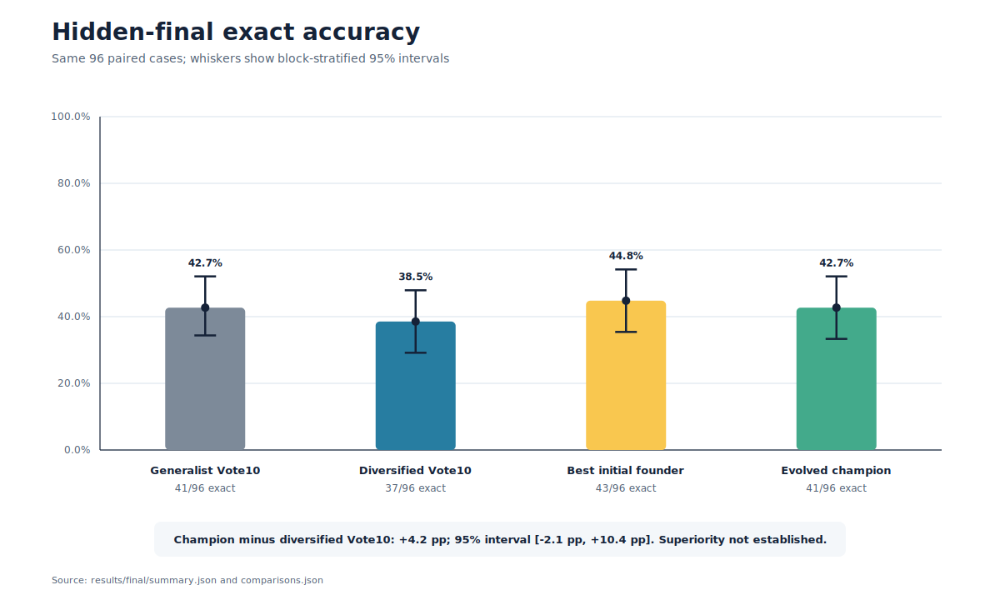
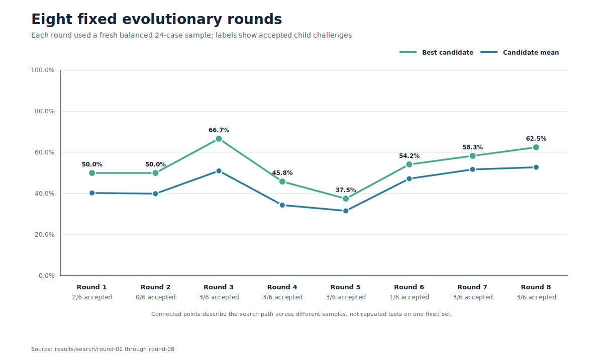

# 04: Evolving the Decider

Can symbolic evolution improve how ten calls using the requested GPT-5.6 Luna Light configuration turn several proposed answers into one decision?

This seed preserves the complete experiment that tested that question. The requested model configuration, Light reasoning setting, sequence task, ten-call deployment budget, output schema, retry rules, and hidden-test procedure stayed fixed. Evolution could change only a bounded symbolic policy: one decision system, ten worker lenses, and one judge policy.

## Result

The validation-selected champion solved 41 of 96 hidden-final cases (42.7%). Diversified Vote10 solved 37 (38.5%). The paired difference was +4.2 percentage points, with a 95% interval from -2.1 to +10.4 points and exact McNemar p = 0.3438.

The interval includes zero, so this experiment did not establish that the evolved method was superior.

| Hidden-final method | Exact cases | Exact accuracy |
|---|---:|---:|
| Best initial founder | **43/96** | **44.8%** |
| Evolved champion | 41/96 | 42.7% |
| Generalist Vote10 | 41/96 | 42.7% |
| Diversified Vote10 | 37/96 | 38.5% |

The best founder and Generalist Vote10 are the same configuration: ten isolated generalist solvers followed by deterministic plurality. They were fresh independent executions, not two architectures. The hidden final therefore had four execution arms but only three unique symbolic configurations. Their 43/96 and 41/96 scores are direct evidence of run-to-run variation. All 80 prompt hashes matched across the two runs, while none of the 80 response hashes matched.



## What evolved

The six legal decision systems all used exactly ten calls per 12-case block:

| System | Ten-call structure | Final rule |
|---|---|---|
| Vote | 10 proposers | Proposal plurality |
| Judge | 9 proposers, 1 judge | Judge answer |
| Gated critic | 7 proposers, 2 critics, 1 judge | Override only when both critics and the judge agree |
| Dual judge | 8 proposers, 2 judges | Use the judges only when they agree |
| Verified | 7 proposers, 2 verifiers, 1 judge | Override only when both verifiers and the judge agree |
| Deliberative | 6 proposers, 2 critics, 2 judges | Override only when both judges and at least one critic agree |

Each genome also chose ten lenses from a frozen eight-lens catalog and one of four judge policies. Models never wrote genomes, prompts, mutation code, or scoring rules. A standard-library controller made four one-gene mutations and two crossovers in every round and rejected duplicate genomes.

## Eight rounds, no early stop

Six persistent parent slots completed all eight registered rounds. In every round, six parents and six children faced the same two fresh 12-case blocks. Each child challenged its designated parent, and only a strictly better child replaced it. Exact ties kept the parent.

Fitness ranked more exact cases first, then stronger weakest-block accuracy, fewer harmful overrides, more correct individual terms, and more format-valid cases. Eighteen of 48 children replaced their parents. The search moved from one survivor of each decision system to a final population with three dual-judge, two deliberative, and one verified policy.



Validation tested all six survivors on 72 fresh cases. It selected `G-A20DBD76963B`, a verified policy with seven proposers, two verifiers, one judge, and a `minority_aware` judge policy. Its worker lenses were:

```text
generalist, recurrences, recurrences, modular, simplicity,
generalist, generalist, generalist, audit, generalist
```

On the hidden final, proposal plurality inside the champion solved 38/96. The final gate solved 41/96. It made 11 overrides: 3 useful, 0 harmful, and 8 neutral. The judge by itself also solved 41/96. The verifier gate blocked 11 other judge changes whose net exact value was zero: 1 useful, 1 harmful, and 9 neutral.

## Benchmark and blinding

RuleWeave-5 presents 12 to 14 integer terms and asks for the next five exactly. It covers polynomial sequences, periodic polynomial differences, affine and second-order recurrences, lagged recurrences, interleaved streams, growing blocks, and modular affine recurrences. Every adjacent block pair covers all 24 family and difficulty cells once.

The benchmark contains 192 search cases, 72 validation cases, and 96 hidden-final cases. All cases, programs, targets, and SHA-256 bindings were generated before collection. Search answers were released one round at a time only after that round's 240 logical calls were terminal. Validation and final answers stayed closed until their 360 and 320 logical calls were terminal. An exact audit found no reused visible prefix, hidden program, or next-five target from Experiments 02 or 03, and no internal duplicates by those definitions.

## Call accounting

The experiment registered 2,600 logical call identities:

- 1,920 during search;
- 360 during validation;
- 320 during the hidden final.

Four schema-invalid first attempts received their one registered identical retry. The ledger therefore contains 2,604 actual model attempts: 2,600 valid outputs and 4 preserved malformed attempts. No infrastructure-failure or protocol-violation attempt occurred.

Equal calls did not mean equal token use. On the final set, the champion used 1,089,820 input tokens because verifiers and its judge received evidence packets. The three independent-vote runs each used about 957,000 to 958,000 input tokens.

## What this run supports

The search genuinely explored and retained different decision systems, and the champion's conservative gate added three exact cases over its own proposer plurality without a harmful override. That is useful mechanism evidence.

The hidden comparison is still inconclusive. The champion tied Generalist Vote10, trailed an independently rerun copy of that same configuration by two cases, and had a paired interval crossing zero against every comparator. This run does not establish a general evolutionary advantage or a universal rule for group decision-making.

A sharper next experiment should reuse one frozen set of seven proposer outputs and give judge-only, verified-gate, critic-gate, and another selector the same three-call decision budget. Repeating each decision arm in fresh sessions on a larger final set would estimate inference variance and isolate decision-layer effects from proposer variation.

## Open the evidence

- [Reusable experimental workflow](SKILL.md)
- [Technical report](experiment/REPORT.md)
- [Frozen protocol](experiment/PROTOCOL.md)
- [Complete experiment guide](experiment/README.md)
- [Benchmark design and files](experiment/benchmark/README.md)
- [Genome catalog, lineage, and freezes](experiment/genomes/README.md)
- [Exact prompts](experiment/prompts/)
- [Run artifacts](experiment/runs/)
- [Scored results](experiment/results/)
- [Independent analysis](experiment/results/analysis.md)

## Continue with Echohive

- [Echohive](https://www.echohive.ai/) is the home for the broader research program and its open experiments.
- [Get Amplified](https://www.echohive.ai/get-amplified) is a practical field guide to working with current models, agents, and harnesses.
- [1000x Lab](https://www.echohive.ai/1000x-lab) is the live Sunday lab where new methods and research questions are tested together.
