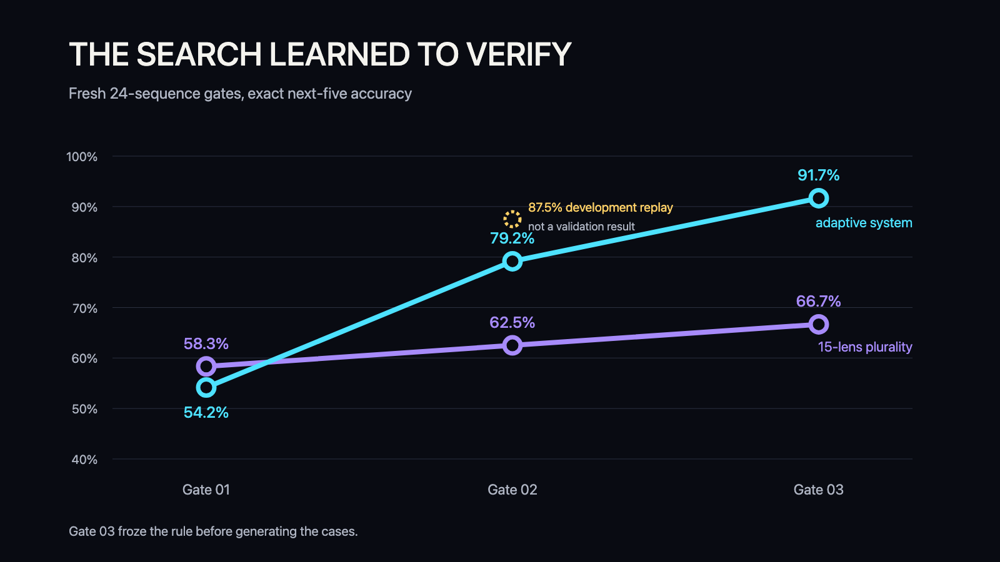
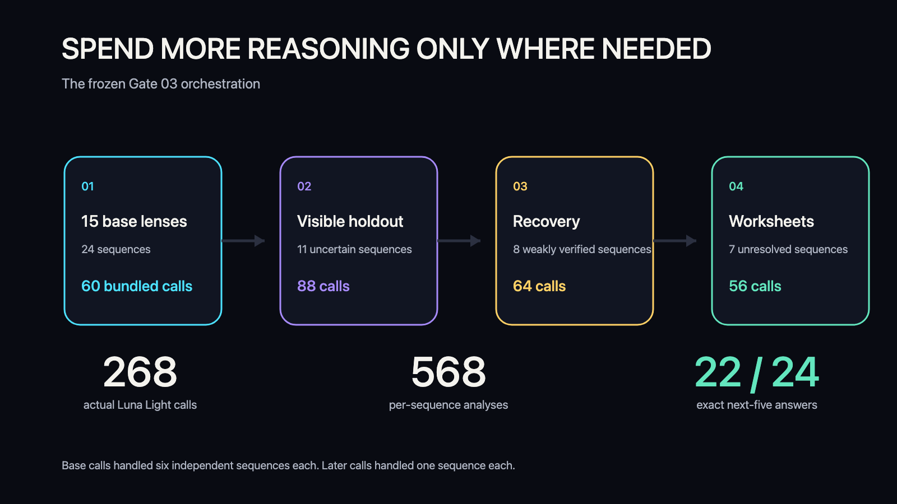
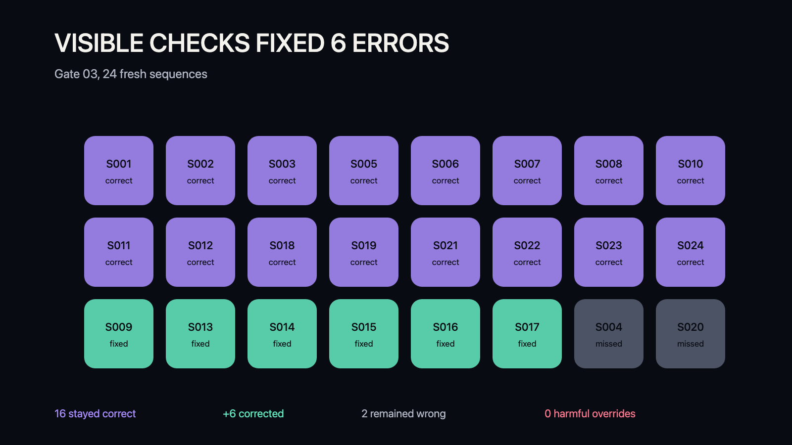
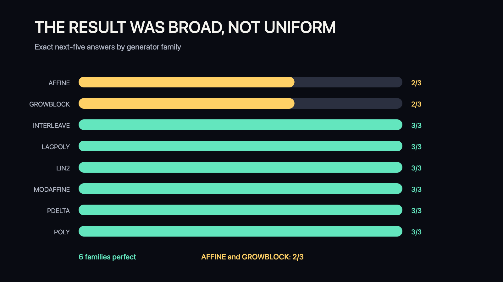
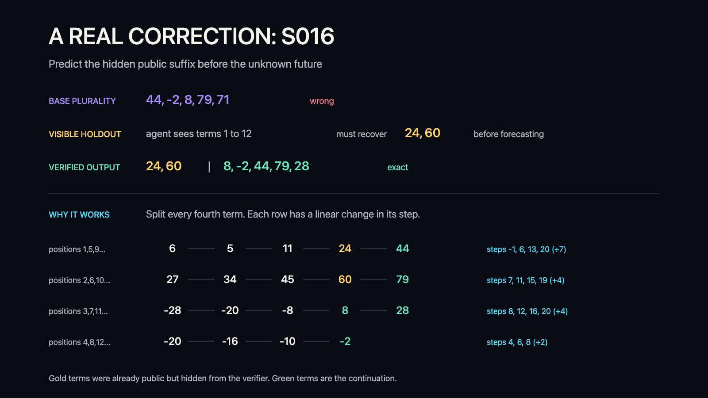

# From Voting to Visible Verification

## The result in one paragraph

Over roughly five hours, we searched for a better way to organize requested GPT-5.6 Luna calls at Light reasoning on hard mathematical sequence tasks. A frozen 15-lens plurality solved 16 of 24 fresh cases, or 66.7%. The final adaptive system solved 22 of 24, or 91.7%, and predicted 112 of 120 future terms correctly. Its key move was simple: before trusting an agent's unknown continuation, hide one to three terms that are already public and require the agent to reconstruct them exactly. On the fresh Gate 03 set, this corrected six plurality errors and harmed zero correct plurality answers.



## What we were trying to learn

Earlier Swarm Seeds experiments showed that more agents and more stages do not automatically improve a result. Light-reasoning judges can be persuaded by confident but incorrect explanations. A larger pipeline can therefore multiply error rather than intelligence.

Experiment 05 asked a broader question:

> Can an adaptive research director search prompts, roles, routing, and deterministic selectors until a Light-reasoning system becomes substantially more reliable?

The search was allowed to try independent solvers, specialized lenses, critics, verifiers, judges, no-judge systems, prompt ensembles, and conditional escalation. All subject calls used the requested `gpt-5.6-luna` model with provider reasoning effort `low`, publicly labeled Light reasoning. Tools, Python, files, web access, skills, plugins, other agents, and external communication were disabled inside every subject call.

## The task and the exact mathematics

Each case showed 12 to 14 integers and required exactly the next five. A case counted as correct only when all five values matched the fixed generator exactly.

Each 24-case fresh gate contained all combinations of eight sequence families and three difficulty tiers once. Let

```text
B_c(t) = sum from d = 0 to D of c_d * C(t, d)
```

where `C(t, d)` is the binomial coefficient. This is an integer-valued polynomial written in the finite-difference basis. The eight families were:

### POLY

```text
x_n = B_c(n - 1)
```

The degree was 3, 4, or 5 by tier.

### PDELTA

```text
x_1 = s
x_n = x_(n-1) + B_(c_r)(q)
r = (n - 2) mod p
q = floor((n - 2) / p)
```

Different phases used different polynomial difference laws.

### AFFINE

```text
x_1 = s
x_n = a_r * x_(n-1) + b_r
r = (n - 2) mod p
```

The multiplier and bias changed periodically.

### LIN2

```text
x_n = u * x_(n-1) + v * x_(n-2) + b_r
r = (n - 3) mod p
```

This was a second-order recurrence with periodic bias.

### LAGPOLY

```text
x_n = x_(n-L) + B_(c_r)(q)
r = (n - 1) mod L
q = floor((n - 1) / L) - 1
```

This creates several lagged streams whose steps change polynomially.

### INTERLEAVE

Two or three independent streams were woven by position. Each stream was either a polynomial stream or an affine stream:

```text
z_(j+1) = m * z_j + b
```

### GROWBLOCK

Block `j` had length `l0 + j`. Its start and within-block step were polynomial laws:

```text
start_j = B_V(j)
step_j  = B_D(j)
block_j[k] = start_j + k * step_j
```

### MODAFFINE

```text
x_n = (a_r * x_(n-1) + b_r) mod M
r = (n - 2) mod p
```

`M` was prime and the affine parameters could change by phase.

The generator rejected internal duplicates and exact overlap with Experiments 02, 03, and 04. A recognizer also checked that every registered program matching the complete public prefix agreed on the same next-five continuation.

## Stage 1: broad orchestration search

The original protocol ran 20 strategies per batch across three search batches. Each strategy could use up to 30 logical calls over two 12-case blocks. The search used 1,722 logical Luna Light calls. Two validation waves used another 990.

On pooled validation, the two selected systems scored:

| System | Exact across two 72-case runs |
|---|---:|
| Sequential Proof Repair | 75/144, 52.1% |
| Large-Base Judge-Free Review | 72/144, 50.0% |
| Fixed control | 67/144, 46.5% |

These were improvements, but not the 60% to 70% accuracy we were seeking. A planned hidden final began, then was stopped at the user's direction after 684 of 720 valid jobs in its first replicate. The answer key was never opened. The partial outputs were never scored or used for selection. This preserved the evidence boundary while avoiding another 756 planned calls.

## Stage 2: search the evidence, not just the topology

We then changed the research loop.

First, we banked 34,510 valid case predictions from completed search and validation runs. They contained 12,491 unique hypotheses over 144 known cases. The best possible answer selector, if it could always identify a correct saved hypothesis, had 81.25% accuracy. Raw plurality had 60.4%.

This exposed the real bottleneck. Correct answers often existed, but subjective critics and judges were not reliably identifying them.

The next systems therefore focused on observable checks:

1. Use varied prompts to generate several hypotheses.
2. Hide one to three terms from the end of the public prefix.
3. Ask agents to reconstruct those public terms and also predict the unknown five.
4. Reject every candidate that fails the reconstruction.
5. Select among the surviving future tuples with deterministic evidence weighting.

## The selector

Let `V` be the verified candidates. Candidate `i` reconstructs `h_i` hidden public terms and proposes future tuple `f_i`. For each possible future tuple `y`, compute:

```text
W(y) = sum over i in V of h_i * I(f_i = y)
```

`I` is 1 when candidate `i` supports `y`, and 0 otherwise. A candidate that reconstructs three public terms therefore contributes three evidence units. A candidate that reconstructs only one contributes one.

Ties were broken by:

1. total reconstructed public terms;
2. deepest reconstructed suffix;
3. number of distinct suffix depths;
4. number of distinct generation stages;
5. raw supporting responses;
6. canonical tuple order.

Self-reported confidence was excluded.

## The final adaptive swarm



The frozen Gate 03 system used:

| Stage | Routing rule | Calls | Per-sequence analyses |
|---|---|---:|---:|
| Base | 15 prompt lenses over four six-case packets | 60 | 360 |
| Visible holdout | Base plurality support at most 5 | 88 | 88 |
| Recovery | At most 3 verified survivors | 64 | 64 |
| Structural worksheets | Maximum verified answer support at most 3 | 56 | 56 |
| Total | | **268** | **568** |

The base stage gave every sequence 15 independent analyses. Later calls handled only one uncertain sequence at a time. This averaged 23.7 analyses per sequence without forcing every case through the full pipeline.

## The progression

| Gate | Frozen method | Exact | Base | Calls | Interpretation |
|---|---|---:|---:|---:|---|
| Fresh Gate 01 | Deep override | 13/24, 54.2% | 14/24, 58.3% | 78 logical, 101 attempts | Worse than base |
| Fresh Gate 02 | Unweighted visible holdout | 19/24, 79.2% | 15/24, 62.5% | 340 | Missed target by one |
| Gate 02 replay | Length-weighted holdout | 21/24, 87.5% | 15/24, 62.5% | 0 new | Post-hoc development only |
| Fresh Gate 03 | Frozen length-weighted holdout | **22/24, 91.7%** | 16/24, 66.7% | 268 | Fresh target reached |

The 87.5% Gate 02 replay is not a validation result. The weighting rule was discovered after Gate 02 answers were open. We froze that rule first, generated a new Gate 03 afterward, and treated only the 91.7% Gate 03 result as the fresh test of the new selector.

## What changed on Gate 03



The base plurality was correct on 16 cases. The adaptive system:

- kept all 16 correct base answers;
- repaired 6 incorrect base answers;
- left 2 cases incorrect;
- introduced 0 harmful overrides.

It also matched the available candidate oracle at 22 of 24. In this run, once a correct candidate existed, the visible-check selector chose it.

Six of the eight generator families scored 3/3. AFFINE and GROWBLOCK scored 2/3.



## One real correction

Case S016 showed:

```text
6, 27, -28, -20, 5, 34, -20, -16, 11, 45, -8, -10, 24, 60
```

The 15-lens plurality predicted:

```text
44, -2, 8, 79, 71
```

It was wrong. A visible-holdout solver saw only the first 12 terms. It first had to reconstruct the already-public `24, 60`, then forecast the next five. Its verified output was:

```text
24, 60 | 8, -2, 44, 79, 28
```

The continuation was exact. The underlying structure appears when every fourth term is separated:

```text
positions 1,5,9,...   6, 5, 11, 24, 44     step changes +7
positions 2,6,10,...  27, 34, 45, 60, 79   step changes +4
positions 3,7,11,...  -28, -20, -8, 8, 28  step changes +4
positions 4,8,12,...  -20, -16, -10, -2    step changes +2
```



## What this suggests

The main lesson is not that 268 agents are required for one sequence. Gate 03 used 268 model calls across 24 sequences. Base calls each handled six independent sequences, and later calls were routed only to uncertain cases.

The more useful lesson is:

> Orchestration improves when agents can demonstrate correctness on evidence that the selector can check.

Weak judges were often bad at ranking persuasive explanations. Visible holdout changed the question from "Which answer sounds best?" to "Which method predicted evidence it could not see?"

This suggests a general design pattern for domains with checkable evidence:

- hide known tests before asking for unknown code behavior;
- mask known rows before accepting a forecasted table;
- remove known facts before trusting a research synthesis;
- test a transformation by asking it to recover reversible inputs;
- spend extra calls only when observable checks remain weak.

These are transfer hypotheses. They were not tested here.

## Limits

- Gate 03 contains only 24 cases. A simple 95% Wilson interval for 22/24 is roughly 74.2% to 97.7%.
- The orchestration and prompts were developed through repeated work inside the sequence domain.
- The final number is a fresh-gate result, not an untouched estimate of arbitrary reasoning ability.
- The original 192-case hidden final was aborted before scoring and provides no performance evidence.
- The prompt and selector are specialized for exact sequence continuation. Generalization to coding, research, forecasting, or non-mathematical tasks remains untested.
- Requested model identity and provider effort are recorded, but provider telemetry did not expose a separate resolved-model identity.

## Reproduce and audit

- [`PROTOCOL.md`](PROTOCOL.md) preserves the original registered design.
- [`EXPLORATORY_EXTENSION.md`](EXPLORATORY_EXTENSION.md) records the pivot and fresh-gate rules.
- [`registrations/fresh-80-gate-03-generation-registration.json`](registrations/fresh-80-gate-03-generation-registration.json) freezes the final architecture before case generation.
- [`registrations/fresh-80-gate-03-registration.json`](registrations/fresh-80-gate-03-registration.json) registers the subject calls.
- [`registrations/fresh-80-gate-03-unseal-registration.json`](registrations/fresh-80-gate-03-unseal-registration.json) records terminal closure before unsealing.
- [`registrations/fresh-80-gate-03-result.json`](registrations/fresh-80-gate-03-result.json) is the registered result.
- [`results/fresh-80-gate-03/score.json`](results/fresh-80-gate-03/score.json) contains every case decision.
- [`scripts/render_stage2_charts.py`](scripts/render_stage2_charts.py) recreates the charts with the Python standard library.

The honest conclusion is narrow but useful: on this fresh 24-case benchmark, an adaptive Light-reasoning swarm with visible self-verification raised exact accuracy from 66.7% to 91.7%.
